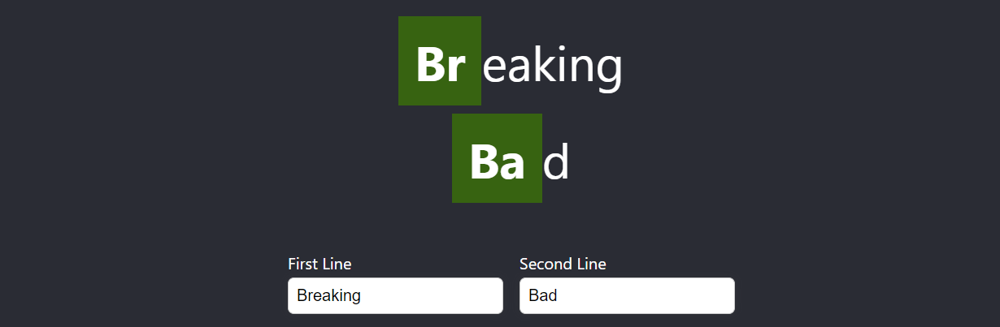

# Breaking Bad logo generator challenge

## Setup
- The project is setup with cra, typescript and jest, install dependencies with `npm i`.
- The app renders the challenge component on the root route `/`.
- The app renders an implementation example on `/goal` route.

##  Challenge

### Given
- A constant array of periodic element strings that
  - contains strings with 2 chars like `Br`
  - contains strings with 1 char like `B`
- A component with 2 input fields and basic markup located in `src/challenges/BreakingBadGenerator.tsx`.

Extend the given component to match the following acceptance criteria.

### 1. Input Handling

- The two component input fields accept user input.
- When the user inputs text into an input field, the component should store that value in state.
- The component should pass the input values to a function for further processing.

### 2. Identify Periodic Element Occurrences
Implement a function that processes the input values. Think about a good data structure to prepare the values for rendering.

- When the function receives a string, it should identify the **first occurrence** of a periodic element.
- If a periodic element with **two chars** is present in the string, it should take priority over any periodic element with one character.
- If no two-char periodic element is present in the string, the function should use the first occurrence of a **one-char** periodic element.
- If no periodic element is found, the string remains as it is.
- The check for periodic element occurrence should be **case insensitive**.

### 3. Logo Rendering
- The component should render the prepared input values in two lines, as the logo.
- The component should highlight the first found periodic element for each logo line.
- Appropriate styling to the logo is applied to make it visually appealing.

## Hints

### Best way to walk through this challenge is to:
1. Implement basic input handling
2. Implement value preparation for periodic occurrences
3. Implement rendering of the logo and styling
